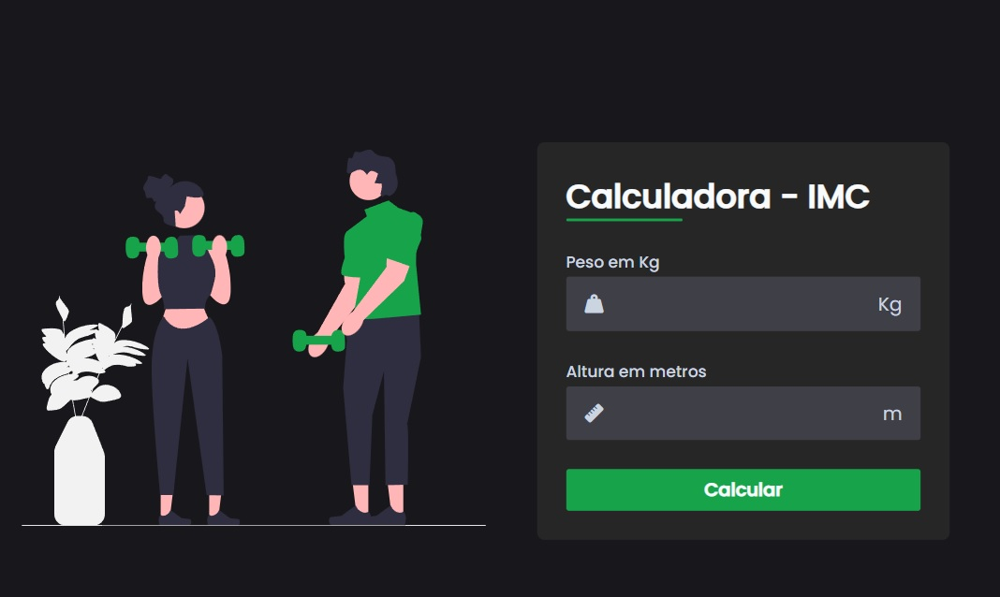

    
   

 

## 💻 Project

The BMI calculator is an online system dedicated to calculating body fat. Its main objective is to facilitate healthy tracking of body weight gain by providing an intuitive platform for checking individual health. System developed for both use on computers and cell phones.

## 🧪 Development

This project was developed using:
- [FontAwesome](https://fontawesome.com)
- [Live Server](https://marketplace.visualstudio.com/items?itemName=ritwickdey.LiveServer)

The app will be available on the browser by accessing the address http://127.0.0.1:5500/index.html
  
